# 🚀 Azure Self-Healing VM Project

A cloud automation project that detects Nginx downtime on an Azure Linux VM and restores service automatically using Azure Logic Apps, Azure Monitor, Log Analytics, and a CronJob fallback flow.

---

## 🌐 Demo & Proof

> ⚠️ Azure resources were decommissioned after demonstration to avoid ongoing costs. Full proof of deployment, infrastructure, and automation is provided below.

- 🎥 **Demo Videos:** [View Demo Links](video-links.md)
- 📝 **Architecture Details:** [Read Architecture Docs](architechture.md)
- 🚨 **Alert Rules Setup:** [View Alert Docs](alert-rule.md)

---

## ✨ Overview

This project demonstrates a practical self-healing workflow for a web service running on an Azure Virtual Machine. Instead of relying on a single point of failure, it implements three distinct recovery paths to ensure high availability: a manual trigger, a CronJob fallback check, and an Azure Monitor Alert Rule.

---

## 🚀 Features

- Automated service restoration without human intervention
- Azure Monitor integration via Log Analytics workspace
- Logic App orchestration for HTTP triggering and remediation
- Azure VM Run Command execution to restart inactive services
- Infrastructure as Code deployment using Bicep
- Three-tier fallback system (Alerts, CronJob, Manual)

---

## 🧠 Tech Stack & Components

- **Compute:** Azure Virtual Machine (Linux), Nginx
- **Monitoring:** Azure Monitor, Log Analytics, Action Groups
- **Automation:** Azure Logic Apps, VM Run Command, Shell Scripts
- **IaC:** Bicep (`Infra/main.bicep`)

---

## ⚙️ How It Works

1. Nginx runs on the Azure Linux VM.
2. A failure is detected (Nginx service stops).
3. The failure is caught via an Azure Alert Rule, a local CronJob script, or triggered manually.
4. An HTTP POST request is sent to the Azure Logic App webhook.
5. The Logic App executes a Run Command (`systemctl restart nginx`) directly on the VM.
6. The service is restored to a healthy state.

---

## 🗺️ Architecture Workflow

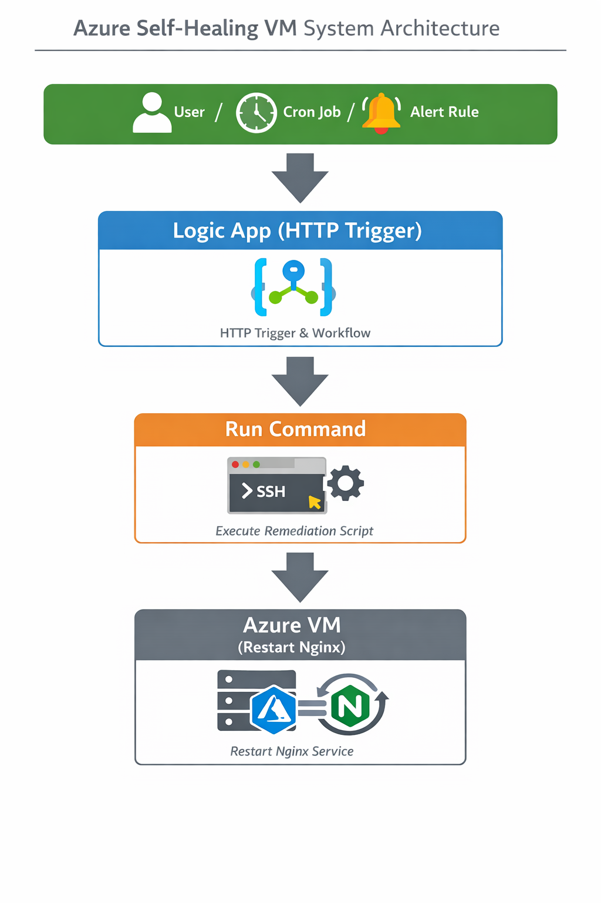

---

## 📸 Infrastructure & Service State

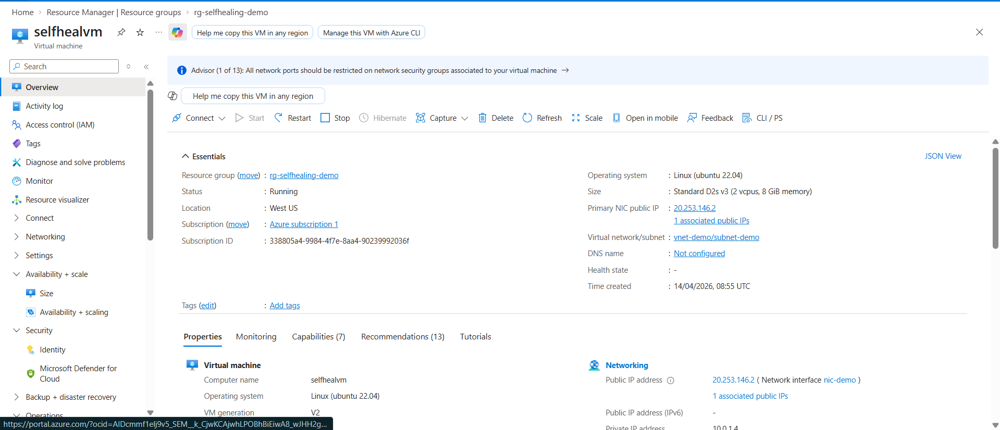
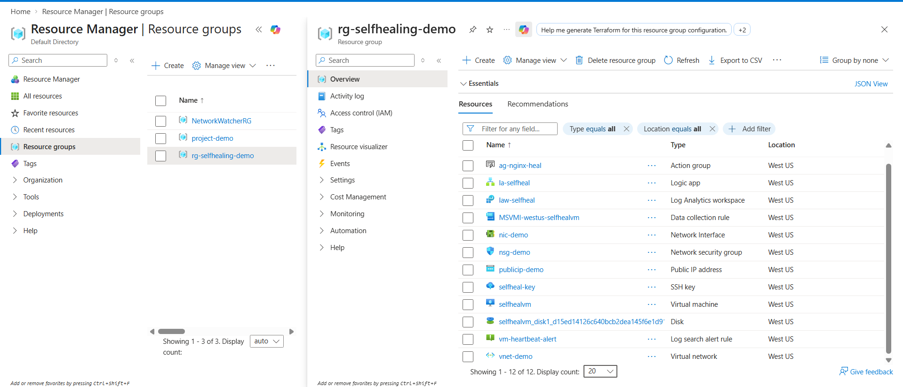
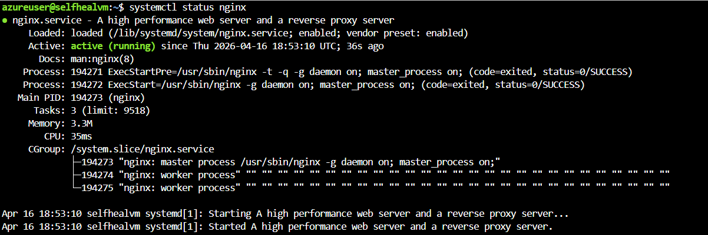
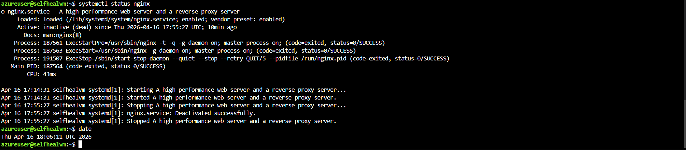

---

## 🔍 Monitoring Layer

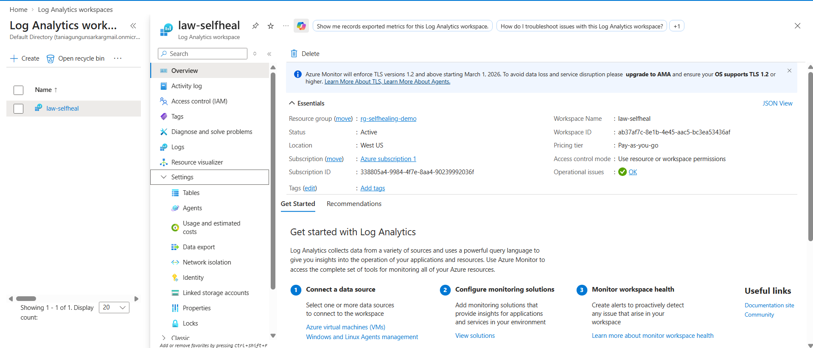
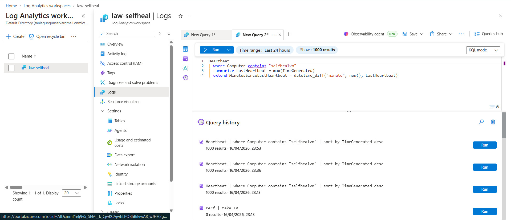
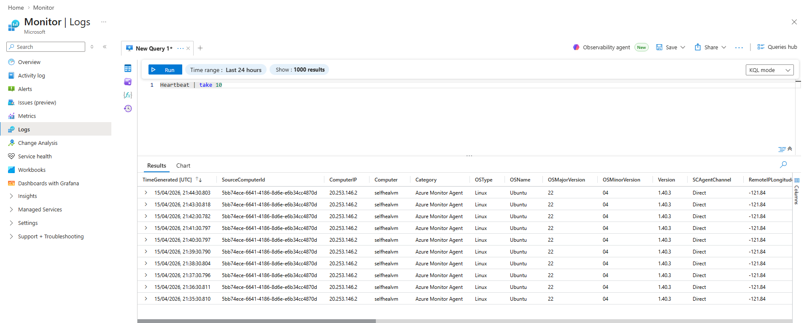

---

## 🚨 Alerting System

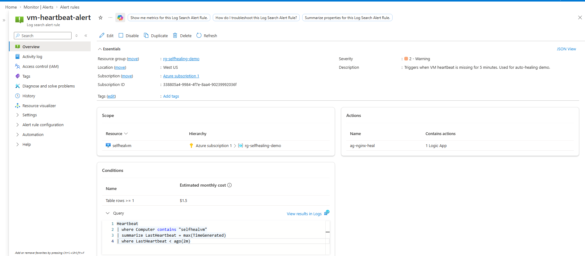
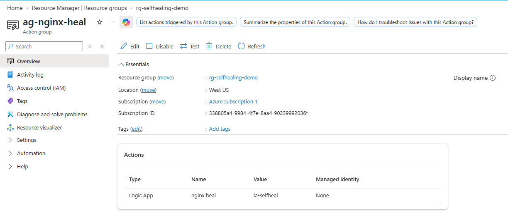

---

## ⚙️ Automation Flow (Logic Apps)

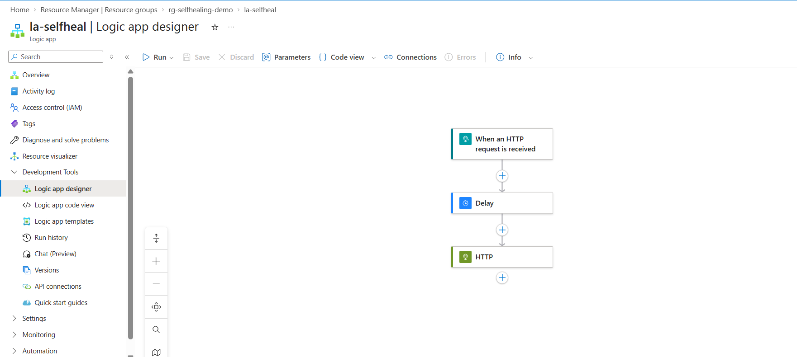
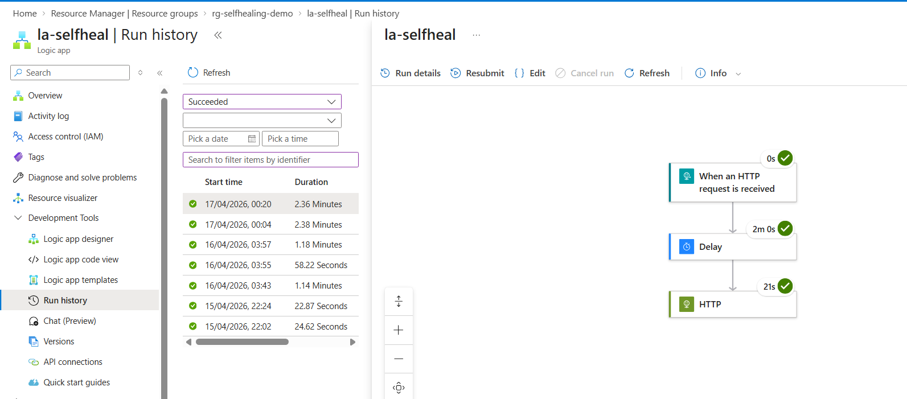
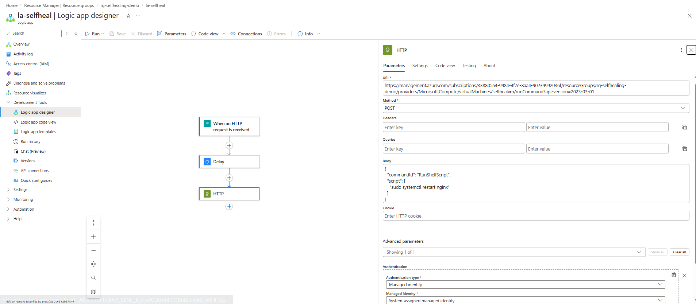

---

## ⏰ Fallback Mechanism & Execution Evidence

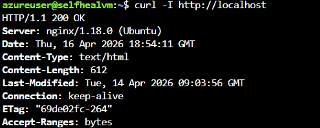
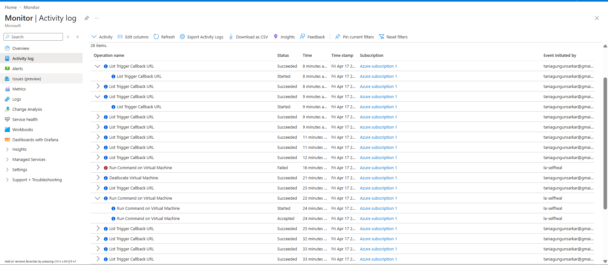

---

## 📚 What I Learned

- Designing resilient, multi-path fallback mechanisms for cloud reliability
- Applying core AZ-104 concepts (Monitor, Action Groups, Logic Apps) in a real-world scenario
- Securely executing Run Commands on Azure VMs without exposing SSH ports
- Utilizing Bicep for repeatable infrastructure deployment
- Managing standard monitoring delays between failure and alert generation
- Handling Run Command conflicts during rapid trigger executions

---

## 🚀 Future Scope

- Expand self-healing to additional services like databases
- Add richer dashboards for live health visualization
- Improve alert precision with advanced KQL query tuning
- Replace fallback CronJob with Azure-native scheduling (e.g., Azure Functions)
- Add automated Slack/Teams notifications for recovery status

---

## 🧾 Note

The Azure resources created for this project were used for testing and demonstration purposes and have been removed to prevent unnecessary billing. All workflows and deployments are preserved via this documentation.

---

### 👩‍💻 Author
**Tania Sarkar** Middleware Engineer | Azure Automation Enthusiast | Cloud Reliability Explorer
