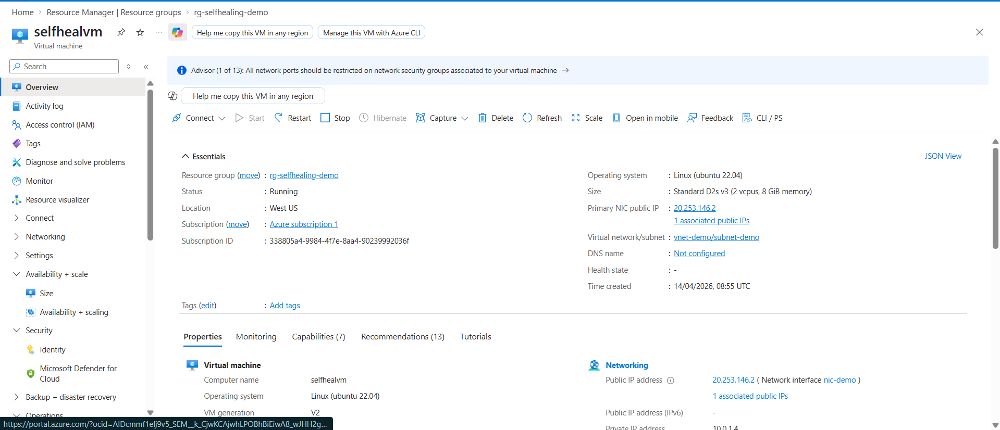
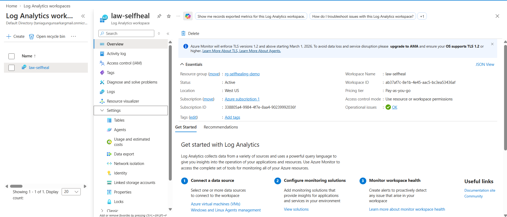
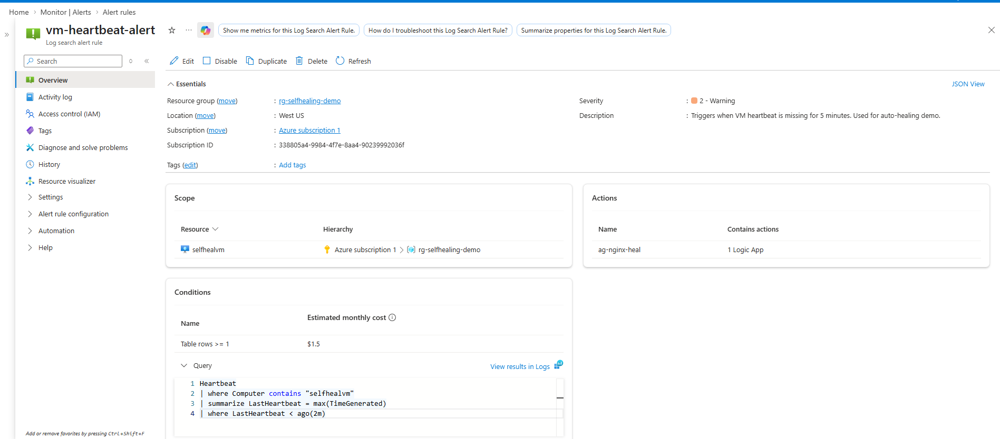
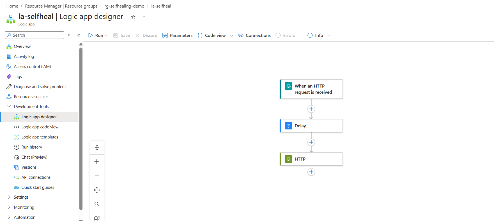
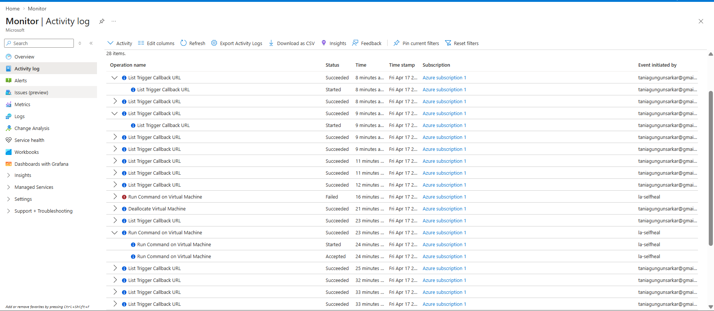
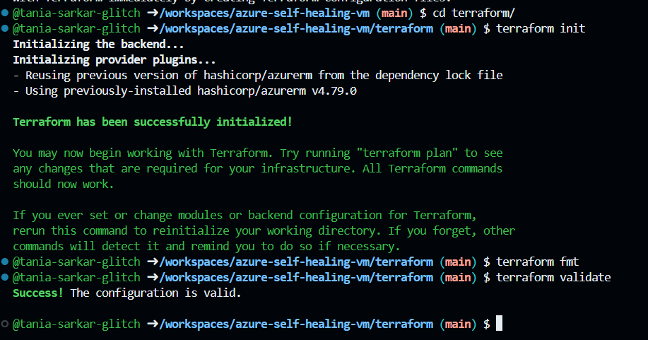

# 🚀 Azure Self-Healing VM | Azure Bicep & Terraform


> ### 🚀 A production-inspired Azure automation project demonstrating Infrastructure as Code, monitoring, alerting, and automated recovery of an Nginx web server using Azure native services.

---

## 📌 Overview

Modern cloud environments should recover automatically from service failures instead of relying solely on manual intervention.

This project demonstrates a **self-healing Azure Linux Virtual Machine** running **Nginx**, where Azure monitoring services continuously monitor application health and automatically initiate recovery whenever the service becomes unavailable.

The infrastructure has been implemented using **two Infrastructure as Code (IaC) technologies**:

* **Azure Bicep** (Azure-native IaC)
* **HashiCorp Terraform** (Provider-based IaC)

This repository showcases cloud automation, Infrastructure as Code, monitoring, alerting, and recovery workflows inspired by real production environments.

---

# 🏗️ Architecture


The solution combines Azure monitoring, automation, and Infrastructure as Code to automatically restore application availability.

📖 **Detailed architecture, workflow, design decisions, and engineering documentation are available in:**

➡️ **[architecture.md](architecture.md)**

---

# ✨ Project Highlights

| Feature                     | Status |
| --------------------------- | :----: |
| Azure Linux Virtual Machine |    ✅   |
| Nginx Web Server            |    ✅   |
| Azure Monitor               |    ✅   |
| Log Analytics Workspace     |    ✅   |
| Alert Rules                 |    ✅   |
| Azure Logic Apps            |    ✅   |
| Azure VM Run Command        |    ✅   |
| Manual Recovery             |    ✅   |
| Cron Job Recovery           |    ✅   |
| Azure Bicep Deployment      |    ✅   |
| Terraform Implementation    |    ✅   |

---

# ☁️ Infrastructure as Code

This project demonstrates the same Azure infrastructure using both Azure-native and cloud-agnostic Infrastructure as Code approaches.

| Azure Resource               | Bicep | Terraform |
| ---------------------------- | :---: | :-------: |
| Resource Group               |   ✅   |     ✅     |
| Virtual Network              |   ✅   |     ✅     |
| Subnet                       |   ✅   |     ✅     |
| Network Security Group       |   ✅   |     ✅     |
| Public IP Address            |   ✅   |     ✅     |
| Network Interface            |   ✅   |     ✅     |
| Ubuntu Linux Virtual Machine |   ✅   |     ✅     |

## Terraform Highlights

The Terraform implementation follows engineering best practices by separating infrastructure into dedicated configuration files.

* Provider configuration
* Version management
* Resource Group
* Networking resources
* Virtual Machine
* Variables
* Outputs

### Terraform Workflow

```bash
terraform init
terraform fmt
terraform validate
terraform plan
terraform apply
```

### Validation

The Terraform configuration has been successfully validated.

```bash
terraform init
terraform fmt
terraform validate
```

Validation Result:

```text
Success! The configuration is valid.
```

> **Note:** Infrastructure deployment requires an authenticated Azure CLI session and an active Azure subscription.

---

# 🛠️ Technology Stack

### ☁️ Cloud

* Microsoft Azure

### 🏗️ Infrastructure as Code

* Azure Bicep
* Terraform

### 💻 Compute

* Azure Linux Virtual Machine
* Ubuntu 22.04 LTS
* Nginx

### 🌐 Networking

* Virtual Network
* Subnet
* Network Security Group
* Public IP
* Network Interface

### 📊 Monitoring

* Azure Monitor
* Log Analytics Workspace
* Alert Rules
* Action Groups

### ⚙️ Automation

* Azure Logic Apps
* Azure VM Run Command
* Bash Scripts
* Linux Cron Jobs

### 🛠️ Development

* Git
* GitHub
* GitHub Codespaces

---

# 📁 Repository Structure

```text
.
├── infra/
│   └── main.bicep
│
├── terraform/
│   ├── provider.tf
│   ├── versions.tf
│   ├── main.tf
│   ├── network.tf
│   ├── vm.tf
│   ├── variables.tf
│   ├── outputs.tf
│   ├── terraform.tfvars.example
│   └── .terraform.lock.hcl
│
├── logic-app/
│   └── self-heal-workflow.json
│
├── scripts/
│   ├── cronjob.sh
│   └── trigger.sh
│
├── screenshots/
│
├── README.md
├── architecture.md
├── alert-rule.md
├── video-links.md
└── architechture.png
```
---

# 🚀 Quick Start

Clone the repository and validate the Terraform configuration locally.

```bash
git clone https://github.com/tania-sarkar-glitch/azure-self-healing-vm.git

cd azure-self-healing-vm/terraform

terraform init

terraform fmt

terraform validate
```

To generate an execution plan:

```bash
terraform plan
```

To deploy the infrastructure:

```bash
terraform apply
```

> **Note:** Running `terraform plan` or `terraform apply` requires:
>
> - Azure CLI installed
> - An authenticated Azure session (`az login`)
> - An active Azure subscription

---

# 📚 Documentation

Additional project documentation is available below.

| Document           | Description                                                                   |
| ------------------ | ----------------------------------------------------------------------------- |
| 📖 architecture.md | Complete architecture, workflow, component explanations, and design decisions |
| 🚨 alert-rule.md   | Azure Monitor alert configuration                                             |
| 🎥 video-links.md  | Demonstration videos                                                          |

---

# 📸 Project Gallery

### ☁️ Azure Infrastructure



Shows the deployed Ubuntu Linux Virtual Machine.

---

### 📊 Monitoring



Azure Monitor continuously checks the health of the Nginx service.

---

### 🚨 Alert Detection



An alert is generated when the monitoring condition is met.

---

### ⚙️ Automated Recovery



Azure Logic App executes VM Run Command to restart Nginx.

---

### ✅ Recovery Completed



The service is restored and Azure records the successful recovery.

---

### 🌍 Terraform Configuration Validation



The Terraform implementation was successfully initialized, formatted, and validated using the standard Terraform workflow before deployment planning.

```bash
terraform init
terraform fmt
terraform validate
```

Validation Result:

```text
Success! The configuration is valid.
```

> Additional screenshots are available in the **docs/screenshots/** folder.

---

# 💼 Skills Demonstrated

### Cloud Engineering

* Microsoft Azure
* Azure Virtual Machines
* Azure Networking
* Azure Monitor
* Azure Logic Apps
* Log Analytics

### Infrastructure as Code

* Azure Bicep
* Terraform
* AzureRM Provider
* Variables
* Outputs
* Infrastructure Validation
* Declarative Infrastructure

### DevOps

* Infrastructure Automation
* Git
* GitHub
* GitHub Codespaces
* Linux Administration
* Bash Scripting

### Reliability Engineering (SRE)

* Monitoring
* Alerting
* Automated Recovery
* Self-Healing Infrastructure
* Operational Resilience

---

# 🚀 Future Improvements

* Terraform Modules
* Remote Terraform State
* Azure Storage Backend
* State Locking
* Azure Key Vault Integration
* GitHub Actions CI/CD Pipeline
* Managed Identity Authentication
* Multi-Environment Deployments
* Kubernetes Deployment
* Prometheus & Grafana Monitoring

---

# 📖 Key Learnings

This project provided hands-on experience with:

* Infrastructure as Code using both Azure Bicep and Terraform
* Azure infrastructure provisioning
* Cloud automation
* Monitoring-driven recovery
* Infrastructure validation
* Linux administration
* Azure networking
* Designing resilient cloud architectures
* Applying DevOps and Site Reliability Engineering concepts

---

# 📌 Project Status

> Azure resources were intentionally decommissioned after successful validation and testing to avoid unnecessary cloud costs.

The Infrastructure as Code templates, Terraform implementation, automation workflows, architecture documentation, scripts, screenshots, and deployment evidence remain available within this repository.

---

# 👩‍💻 Author

**Tania Sarkar**

Middleware Engineer • Azure Cloud • Infrastructure as Code • Terraform • Bicep • DevOps • Cloud Automation • Site Reliability Engineering

If you found this project helpful, feel free to ⭐ the repository or connect with me to discuss Cloud Engineering, Infrastructure as Code, Azure, Terraform, DevOps, or Site Reliability Engineering.
