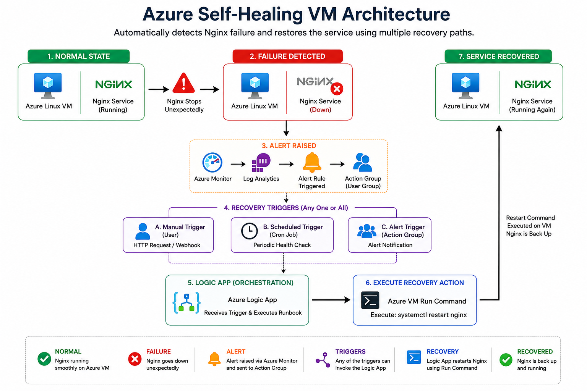

# 🏗️ Architecture Overview

## Document Information

| Item                   | Details                                                    |
| ---------------------- | ---------------------------------------------------------- |
| Project                | Azure Self-Healing VM                                      |
| Cloud Platform         | Microsoft Azure                                            |
| Infrastructure as Code | Azure Bicep & Terraform                                    |
| Architecture Pattern   | Monitoring-Driven Self-Healing Infrastructure              |
| Purpose                | Automated Detection and Recovery of Nginx Service Failures |

---

## Architecture Summary

This project demonstrates a production-inspired Azure infrastructure designed around monitoring, automation, modular Infrastructure as Code, and identity-based security.

The solution combines Azure-native services with reusable Terraform modules to provision infrastructure that is secure, maintainable, and scalable while automatically recovering application failures with minimal operational intervention.

---

# Project Goal

The objective of this project is to design a resilient Azure infrastructure capable of automatically recovering from application-level failures.

An Ubuntu Linux Virtual Machine hosts an Nginx web server. Rather than relying solely on manual intervention, Azure Monitor continuously evaluates the application's health. When the service becomes unavailable, Azure automation services initiate recovery workflows to restore application availability with minimal downtime.

To demonstrate Infrastructure as Code (IaC) best practices, the complete Azure environment has been implemented using both **Azure Bicep** and **HashiCorp Terraform**.

---

# Architecture Objectives

The architecture was designed with the following objectives:

* Demonstrate Infrastructure as Code using Azure Bicep and Terraform
* Implement monitoring-driven incident detection
* Automate recovery of failed application services
* Minimize operational downtime
* Reduce manual intervention
* Demonstrate cloud automation using Azure native services
* Follow reusable and maintainable infrastructure design principles
* Demonstrate modular Terraform architecture
* Implement identity-based authentication using Managed Identity
* Secure application secrets using Azure Key Vault and RBAC

---

# Architecture Diagram



---

# End-to-End Recovery Workflow

## Step 1 – Application Hosting

An Azure Linux Virtual Machine hosts an Nginx web server responsible for serving HTTP requests.

```text
Azure Linux Virtual Machine
            │
            ▼
       Nginx Service
```

During normal operation, the service remains healthy and continuously serves client requests.

---

## Step 2 – Failure Detection

If the Nginx service stops unexpectedly due to a crash, configuration issue, or manual shutdown, the web application becomes unavailable.

```text
Nginx Running
      │
      ▼
Nginx Service Stops
```

This event initiates the automated recovery workflow.

---

## Step 3 – Continuous Monitoring

Azure Monitor continuously evaluates application health using logs collected by Log Analytics Workspace.

When the configured monitoring condition evaluates to true, Azure Monitor generates an alert indicating that the Nginx service is no longer running.

---

## Step 4 – Alert Generation

The Alert Rule is triggered whenever the monitoring query detects a service failure.

The alert can simultaneously:

* Notify administrators
* Trigger Azure automation workflows

```text
Azure Monitor
      │
      ▼
 Alert Rule
```

---

## Step 5 – Recovery Mechanisms

The architecture demonstrates three different recovery approaches.

### Option 1 – Automated Recovery (Logic App)

The Alert Rule invokes an Action Group, which triggers an Azure Logic App.

The Logic App executes Azure VM Run Command to restart the Nginx service automatically.

```text
Alert Rule
      │
      ▼
 Action Group
      │
      ▼
 Azure Logic App
      │
      ▼
 VM Run Command
      │
      ▼
Restart Nginx
```

This represents the primary self-healing workflow.

---

### Option 2 – Manual Recovery

The Alert Rule notifies an administrator, who manually restarts the service.

```text
Alert Rule
      │
      ▼
Administrator
      │
      ▼
Restart Nginx
```

This provides operational control whenever manual investigation is preferred.

---

### Option 3 – Local Cron Job Recovery

A Linux Cron Job running inside the virtual machine periodically checks whether Nginx is active.

If the service is found to be stopped, the Cron Job executes:

```bash
systemctl restart nginx
```

This provides a fallback recovery mechanism independent of Azure monitoring.

---

## Step 6 – Service Restoration

Regardless of the recovery path, the Nginx service is restarted and resumes serving incoming traffic.

```text
Restart Nginx
      │
      ▼
Nginx Running
```

Application availability is restored without rebuilding or replacing the virtual machine.

---

# Enterprise Security Architecture

The Terraform implementation extends the original solution by introducing enterprise security practices commonly adopted in Azure production environments.

## Managed Identity

The Linux Virtual Machine is assigned a User Assigned Managed Identity.

This identity enables Azure services to authenticate securely without storing credentials inside the virtual machine.

---

## Azure Key Vault

Azure Key Vault stores sensitive configuration values and application secrets.

Rather than embedding credentials within application code or Terraform configuration files, secrets are retrieved securely using Azure identity.

---

## Azure RBAC

Access to Azure Key Vault is granted through Azure Role-Based Access Control (RBAC).

Only the Managed Identity attached to the virtual machine receives permission to access Key Vault secrets, following the principle of least privilege.

---

# Architecture Components

| Component                   | Responsibility                                          |
| --------------------------- | ------------------------------------------------------- |
| Azure Linux Virtual Machine | Hosts the application workload                          |
| Nginx                       | Web service monitored for availability                  |
| Azure Monitor               | Continuously evaluates application health               |
| Log Analytics Workspace     | Stores monitoring logs and query data                   |
| Alert Rule                  | Detects service failure conditions                      |
| Action Group                | Connects alerts to notification and automation services |
| Azure Logic App             | Coordinates automated recovery                          |
| Azure VM Run Command        | Executes restart commands within the VM                 |
| Linux Cron Job              | Provides local fallback recovery                        |
| Azure Bicep                 | Azure-native Infrastructure as Code implementation      |
| Terraform                   | Provider-based Infrastructure as Code implementation    |
| Managed Identity            | Provides passwordless authentication                    |
| Azure Key Vault             | Secure storage for secrets                              |
| Azure RBAC                  | Identity-based authorization                            |

---

# Infrastructure Implementation

The Azure infrastructure has been implemented using two Infrastructure as Code technologies.

## Azure Bicep

The original implementation provisions Azure infrastructure using Azure-native Bicep templates.

This deployment creates:

* Resource Group
* Virtual Network
* Subnet
* Network Security Group
* Public IP Address
* Network Interface
* Ubuntu Linux Virtual Machine

---

## Terraform

The same infrastructure has been recreated using the AzureRM Terraform Provider.

The Terraform implementation follows a modular file organization by separating infrastructure into logical configuration files.

```text
terraform/

terraform/

├── modules/
│   ├── resource-group/
│   ├── networking/
│   ├── virtual-machine/
│   ├── managed-identity/
│   └── key-vault/
│
├── locals.tf
├── provider.tf
├── versions.tf
├── outputs.tf
├── variables.tf
├── network.tf
├── vm.tf
├── managed-identity.tf
├── key-vault.tf
```

Each Terraform module is responsible for a single infrastructure domain. The root module orchestrates the deployment by passing outputs between modules, enabling loose coupling, reusability, and enterprise Infrastructure as Code practices.

---

# Terraform Module Architecture

The Terraform implementation follows a modular architecture where each module has a clearly defined responsibility.

| Module | Responsibility |
|----------|----------------|
| Resource Group | Deploys Azure Resource Groups |
| Networking | Deploys VNet, Subnet, NSG, Public IP and NIC |
| Virtual Machine | Deploys Ubuntu Linux Virtual Machine |
| Managed Identity | Creates User Assigned Managed Identity |
| Key Vault | Creates Azure Key Vault |
| Root Module | Connects modules together using outputs |

---

# Design Decisions

## Why Azure Bicep?

Azure Bicep provides a concise Azure-native language that simplifies ARM template development while maintaining tight integration with Azure Resource Manager.

---

## Why Terraform?

Terraform enables provider-independent Infrastructure as Code and follows a declarative approach that is widely adopted across multi-cloud environments.

---

## Why Ubuntu Linux?

Ubuntu is lightweight, production-ready, and one of the most commonly deployed Linux distributions in Azure environments.

---

## Why Nginx?

Nginx provides a simple, lightweight web server that is ideal for demonstrating monitoring and automated recovery scenarios.

---

## Why Azure Logic Apps?

Logic Apps provide a serverless orchestration platform capable of integrating monitoring events with Azure automation workflows.

---

## Why Azure VM Run Command?

VM Run Command allows secure remote execution of commands without requiring direct SSH access to the virtual machine.

---

## Why Cron Job?

The Cron Job provides an additional recovery layer that operates independently of Azure monitoring services, increasing overall resilience.

---

## Why Managed Identity?

Managed Identity eliminates the need to store credentials inside applications or infrastructure code. Azure automatically manages authentication, reducing operational overhead and improving security.

---

## Why Azure Key vault?

Azure Key Vault centralizes secret management and allows workloads to retrieve sensitive information securely using Azure identities instead of embedded credentials.

---

# Failure Scenarios

### Scenario 1 – Application Failure

```text
Nginx Stops
      │
      ▼
Azure Monitor Detects Failure
      │
      ▼
Alert Rule
      │
      ▼
Logic App
      │
      ▼
Restart Nginx
```

---

### Scenario 2 – Manual Operational Recovery

```text
Alert Rule
      │
      ▼
Administrator
      │
      ▼
Restart Service
```

---

### Scenario 3 – Monitoring Unavailable

```text
Azure Monitoring Unavailable
          │
          ▼
Linux Cron Job
          │
          ▼
Restart Nginx
```

---

![High-Level Architecture Flow] (docs/Architechture/High-Level Architecture Flow.png)

---

# Architecture Principles

The solution has been designed around the following engineering principles:

* Infrastructure as Code
* Modular Infrastructure
* Separation of Concerns
* Least Privilege Access
* Identity-based Authentication
* Monitoring-Driven Operations
* Automated Incident Response
* Reusability
* Maintainability
* Cloud Reliability
* Operational Simplicity

---

# Conclusion

This project demonstrates how Azure native monitoring, automation, and security services can be combined with Infrastructure as Code to build a resilient and production-inspired cloud platform.

By implementing the solution using both Azure Bicep and modular Terraform, the project showcases two Infrastructure as Code approaches while emphasizing reusable architecture, identity-based security, operational resilience, and cloud engineering best practices.